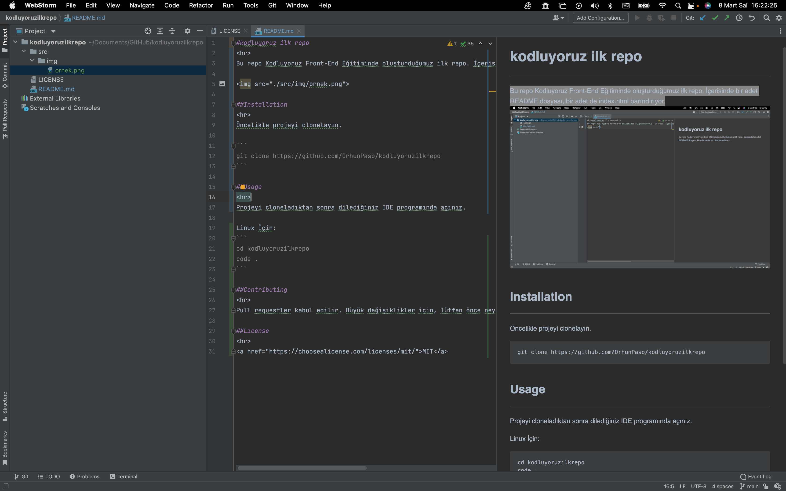

# kodluyoruz ilk repo

Bu repo Kodluyoruz Front-End Eğitiminde oluşturduğumuz ilk repo. İçerisinde bir adet README dosyası, bir adet de index.html barındırıyor.

</img>

## Installation

Öncelikle projeyi clonelayın. 

```
git clone https://github.com/OrhunPaso/kodluyoruzilkrepo
```

## Usage

Projeyi cloneladıktan sonra dilediğiniz IDE programında açınız.

Linux İçin:
```
cd kodluyoruzilkrepo
code .
```

## Contributing

Pull requestler kabul edilir. Büyük değişiklikler için, lütfen önce neyi değiştirmek istediğinizi tartışmak için bir konu açınız.

## Lıcense

<a href="https://choosealicense.com/licenses/mit/">MIT</a>